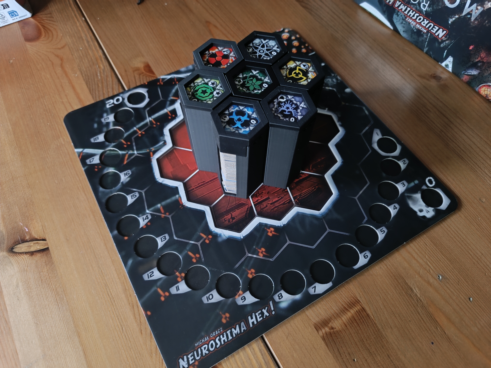
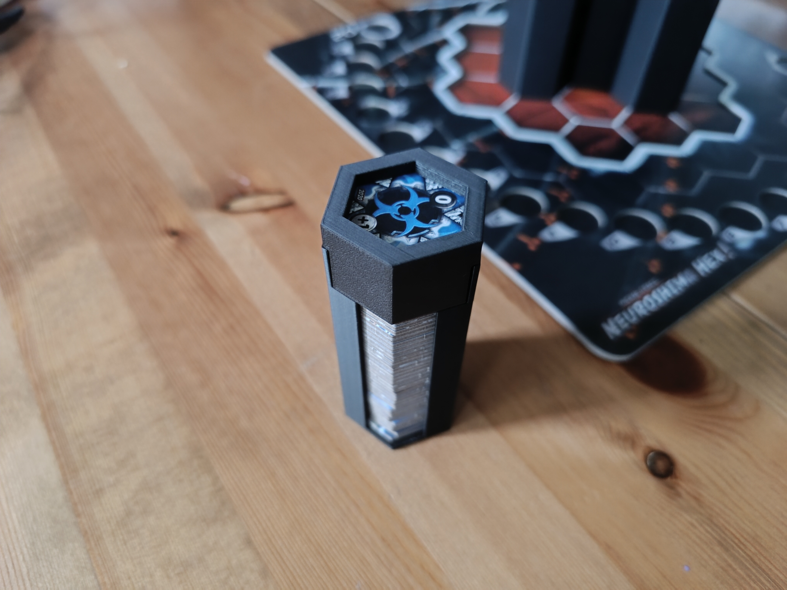
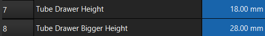

# Description
The main goal of this project is to allow for easy creation of a custom insert and/or storage solution for the board game Neuroshima Hex by Michał Oracz. The designs so far include:

## 1. An army storage tube with a snap-fit lid (drawer)
  
  
  Each army needs one of [ArmyTube](./neuroshima-hex-ArmyTube.stl) and [ArmyTubeDrawer](./neuroshima-hex-ArmyTubeDrawer.stl). The tube is designed to accomodate even the extraordinarily thick Year of the Moloch edition tokens. __However__, there is one important thing to keep in mind: some of the expansions include a lot of small markers (e.g. "electric plugs" of Uranopolis). The board tokens of these armies will fit just fine in the standard tubes, however __the small markers WILL NOT fit in the standard drawers__! For this reason, I include a [slightly bigger drawer](./neuroshima_hex-ArmyTubeBiggerDrawer.stl) that is compatible with the [slightly cut tube](./neuroshima_hex-ArmyTubeCut.stl) (but __will not allow thicker armies to fit below__). I do not have all the expansions and so far I can confirm the following expansions need the bigger drawer + cut tube:

  - Uranopolis
  - Sharrash
  
  I can also confirm the following expansion do not need the bigger drawer + cut tube:

  - Neojungle
  - Vegas
  - SMART
  - New York
  
  As a side note, to achieve the designs of the bigger drawer + cut tube in the provided FreeCad file, simply replace the value next to "Tube Drawer Height" with the value next to "Tube Drawer Bigger Height" in the spreadsheet and recompute both the drawer and the tube.

  

  ## Print settings
  The models have been thoroughly tested on a Bambu Lab P1S with a 0.4 standard nozzle. The tubes do not need supports, the drawers do need supports (preferably tree) and should be printed on one of the flat sides. I used a layer height of 0.2 mm and 15% sparse infill. The models do not require any post-processing (other than support removal) for standard usage.